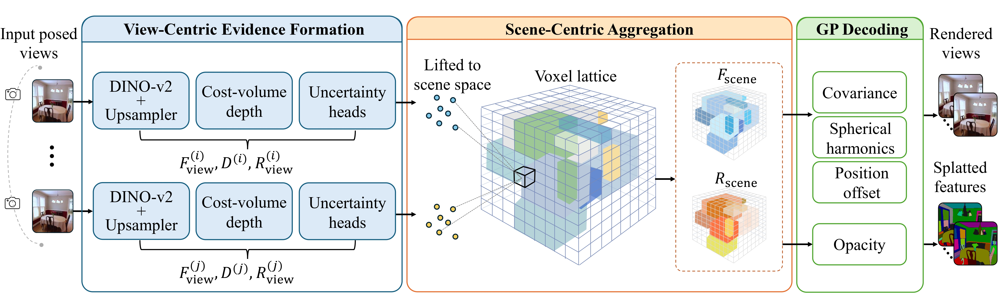

<p align="center">
  <h1 align="center">Learning Stable Canonical Worlds for Novel View Synthesis and Beyond</h1>
  <p align="center">
    <a>Xiaoyu Xu</a>
    ·
    <a>Jian Zou</a>
    ·
    <a>Sheyang Tang</a>
    ·
    <a>Zhihua Wang</a>
    ·
    <a>Jing Liao</a>
    ·
    <a>Kede Ma</a>
  </p>
  <h3 align="center"><a href="https://arxiv.org/abs/2606.23027">Paper</a></h3>
  <div align="center"></div>
</p>
<p align="center">
  <a href="assets/figs/teaser.jpg">
    
  </a>
</p>

<p>
CanonicalGS learns stable internal representations with increased input views. Such capability positions the feed-forward Gaussian splatting as not only a novel view renderer but also a canonical scene representation learner.
</p>


## Installation

CanonicalGS is developed with Python 3.10, PyTorch 2.4.0, CUDA 12.4, MinkowskiEngine, and a patched Swin3D submodule. The installation script builds all dependencies inside a conda environment; it does not copy packages from another environment or modify system libraries.

```bash
git clone --recursive https://github.com/x423xu/CanonicalGS.git
cd CanonicalGS

bash scripts/install_canonicalgs_env.sh
conda activate "$PWD/.conda/canonicalgs"
```

Useful installation variables:

```bash
# Optional: install outside the repository.
export CANONICALGS_ENV_PREFIX=/path/to/conda/envs/canonicalgs

# Optional: choose CUDA arch and compiler parallelism before install.
export CANONICALGS_CUDA_ARCH_LIST=8.6
export MAX_JOBS=8

bash scripts/install_canonicalgs_env.sh --force
```

The script also initializes `third_party/Swin3D`, verifies the CanonicalGS Swin3D fixes, installs this repository in editable mode, and checks that the compiled Swin3D CUDA extensions import correctly.

## Data Preparation

CanonicalGS expects preprocessed PyTorch chunk datasets. Please refer to [depthsplat](https://github.com/cvg/depthsplat) for details. Put data under `datasets/` or override `dataset.roots` in the commands below.

```text
datasets/
  re10k/
    train/*.torch
    train/index.json
    test/*.torch
    test/index.json
  dl3dv/
    train/*.torch
    train/index.json
    test/*.torch
    test/index.json
```

A common setup is:

```bash
ln -s /path/to/your/datasets datasets
```

The compact evaluation indices shipped with this repo are:

```text
assets/re10k_2v.json   assets/re10k_4v.json   assets/re10k_6v.json   assets/re10k_8v.json
assets/dl3dv_2v.json   assets/dl3dv_4v.json   assets/dl3dv_6v.json   assets/dl3dv_8v.json
```

The released checkpoints are hosted on Hugging Face, not in git. Download them into `checkpoints/` before evaluation:

```bash
pip install -U huggingface_hub
mkdir -p checkpoints

# Replace this with the final Hugging Face repo id after release.
export CANONICALGS_HF_REPO=<huggingface-user-or-org>/CanonicalGS
huggingface-cli download "$CANONICALGS_HF_REPO" re10k.ckpt --local-dir checkpoints --local-dir-use-symlinks False
huggingface-cli download "$CANONICALGS_HF_REPO" dl3dv.ckpt --local-dir checkpoints --local-dir-use-symlinks False
```

CanonicalGS does not require Git LFS. Checkpoints are ignored by git so accidental large-file commits stay out of the repository.

## Inference and Evaluation

### RealEstate10K

Use `scripts/evaluation.py` for the default 2-view RealEstate10K evaluation. It sets the CanonicalGS scene-field overrides and can cap the number of scenes for quick tests.

```bash
export CANONICALGS_RE10K_ROOT=/path/to/datasets/re10k
CUDA_VISIBLE_DEVICES=0 python scripts/evaluation.py \
  --checkpoint checkpoints/re10k.ckpt \
  --index-path assets/re10k_2v.json \
  --output-dir outputs/evaluation/re10k_2v \
  --num-scenes 100 \
  --evidence-fusion-type mean \
  --voxel-resolution-scale 3.0 \
  --cuda-device 0
```

To save qualitative outputs, add flags such as `--save-image`, `--save-gt-image`, `--save-depth`, or `--save-gaussian`.

To export the learned scene latent feature before the GP decoder, use `--output-latent-scene`. This export is intended for one scene at a time, so `--num-scenes` must be exactly `1`.

```bash
export CANONICALGS_RE10K_ROOT=/path/to/datasets/re10k
CUDA_VISIBLE_DEVICES=0 python scripts/evaluation.py \
  --checkpoint checkpoints/re10k.ckpt \
  --index-path assets/re10k_2v.json \
  --output-dir outputs/latent_scene/re10k_2v \
  --num-scenes 1 \
  --evidence-fusion-type mean \
  --voxel-resolution-scale 3.0 \
  --cuda-device 0 \
  --output-latent-scene
```

The output is saved as `outputs/latent_scene/re10k_2v_scale3.0/latent_scene/<scene>/latent_scene.pt` and contains `latent_scene`, sparse `coords`, scene-lattice metadata, and camera metadata.

### DL3DV

DL3DV evaluation uses the Hydra entrypoint directly. Change the index and `num_context_views` together for 2/4/6/8-view evaluation.

```bash
CUDA_VISIBLE_DEVICES=0 python -m canonicalgs.main +experiment=dl3dv \
  mode=test \
  dataset.roots=[/path/to/datasets/dl3dv] \
  dataset/view_sampler=evaluation \
  dataset.view_sampler.index_path=assets/dl3dv_2v.json \
  dataset.view_sampler.num_context_views=2 \
  checkpointing.pretrained_model=checkpoints/dl3dv.ckpt \
  test.compute_scores=true \
  test.render_chunk_size=10 \
  output_dir=outputs/evaluation/dl3dv_2v
```

## Training

Before training, place the UniMatch depth checkpoint at the path used by the config:

```bash
mkdir -p pretrained
wget https://s3.eu-central-1.amazonaws.com/avg-projects/unimatch/pretrained/gmdepth-scale1-resumeflowthings-scannet-5d9d7964.pth \
  -O pretrained/gmdepth-scale1-resumeflowthings-scannet-5d9d7964.pth
```

Training uses all GPUs visible in `CUDA_VISIBLE_DEVICES`. The examples below disable in-loop validation with `train.eval_model_every_n_val=0`; run the evaluation commands above for reproducible reporting. Adjust `data_loader.train.batch_size` to fit your GPUs, and keep the total training budget comparable when changing GPU count or batch size.

### RealEstate10K

```bash
CUDA_VISIBLE_DEVICES=0,1,2,3 python -m canonicalgs.main +experiment=re10k \
  dataset.roots=[/path/to/datasets/re10k] \
  output_dir=outputs/train/re10k \
  wandb.mode=disabled \
  train.eval_model_every_n_val=0 \
  trainer.max_steps=300001
```

Resume from the latest checkpoint in the same output directory:

```bash
CUDA_VISIBLE_DEVICES=0,1,2,3 python -m canonicalgs.main +experiment=re10k \
  dataset.roots=[/path/to/datasets/re10k] \
  output_dir=outputs/train/re10k \
  checkpointing.resume=true \
  wandb.mode=disabled \
  train.eval_model_every_n_val=0
```

### DL3DV

```bash
CUDA_VISIBLE_DEVICES=0,1,2,3 python -m canonicalgs.main +experiment=dl3dv \
  dataset.roots=[/path/to/datasets/dl3dv] \
  output_dir=outputs/train/dl3dv \
  wandb.mode=disabled \
  train.eval_model_every_n_val=0 \
  trainer.max_steps=300001
```

Important config names for reimplementation:

```text
model.encoder.gaussians_per_voxel
model.encoder.voxel_resolution_scale
model.encoder.scene_field_encoder_size
model.encoder.evidence_fusion_type
optimizer.lr_scene_field_encoder
```

## Citation

```
@misc{xu2026learningstablecanonicalworlds,
      title={Learning Stable Canonical Worlds for Novel View Synthesis and Beyond}, 
      author={Xiaoyu Xu and Jian Zou and Sheyang Tang and Zhihua Wang and Jing Liao and Kede Ma},
      year={2026},
      eprint={2606.23027},
      archivePrefix={arXiv},
      primaryClass={cs.CV},
      url={https://arxiv.org/abs/2606.23027}, 
}
```


## Acknowledgements

This project is developed with several fantastic repos: [pixelSplat](https://github.com/dcharatan/pixelsplat), [MVSplat](https://github.com/donydchen/mvsplat), [DepthSplat](https://github.com/cvg/depthsplat).


